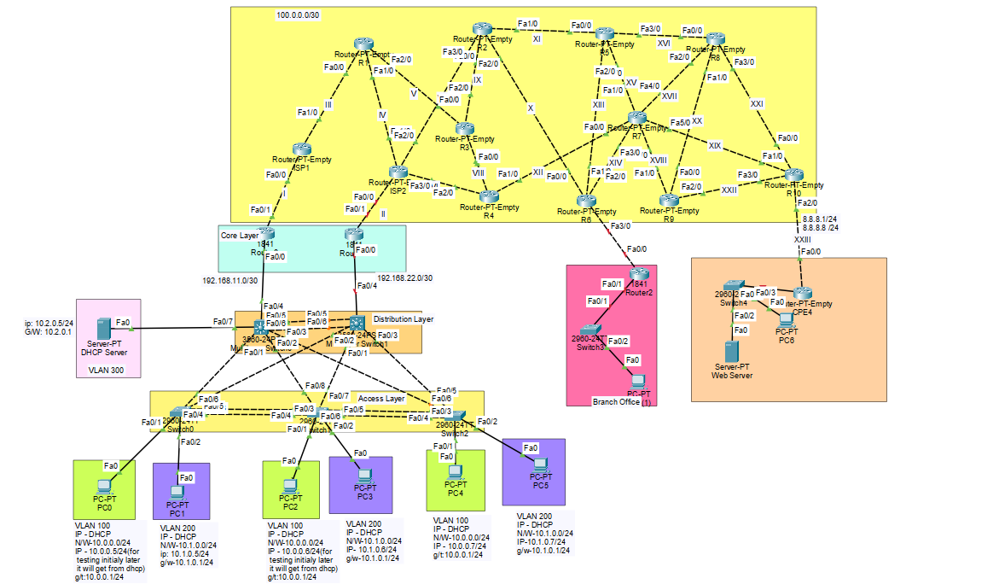

# Enterprise Multi-Site Network Infrastructure

## 1. Project Overview

This project demonstrates the design and implementation of a **redundant enterprise network infrastructure** consisting of a Main Office, WAN/Internet connectivity, and Branch Office connectivity.

The network is designed using a combination of **Layer 2 switching, Layer 3 routing, VLAN segmentation, gateway redundancy, dynamic routing, NAT, network security, and GRE tunneling**.

The Main Office LAN is divided into multiple VLANs to provide logical network segmentation. Layer 3 multilayer switches perform inter-VLAN routing and use HSRP to provide gateway redundancy.

The Main Office is connected to the Internet through **two independent Internet connections**, providing primary and backup connectivity.

The WAN infrastructure uses `/30` point-to-point networks, while OSPF is used across the ISP/WAN section for dynamic route exchange.

A centralized DHCP Server is deployed in VLAN 300, allowing clients in VLAN 100 and VLAN 200 to obtain their IP addresses dynamically through DHCP relay.

For Branch Office connectivity, a **GRE tunnel** is established between the Main Office router and the Branch Office router. Static routes are configured through the GRE tunnel to allow communication between the private networks at both locations.

PAT is implemented at the Main Office edge router to provide Internet access to internal private networks.

Port Security, EtherChannel, HSRP, and Rapid-PVST are also implemented to improve the availability, reliability, and security of the network.

---

# 2. Network Architecture

### Main Office

The Main Office contains:

- Access-layer switches
- Multilayer switches
- WAN/edge routers
- DHCP Server
- Internal network users
- VLAN-based network segmentation
- Dual Internet connectivity

### Branch Office

The Branch Office contains:

- WAN router
- LAN switch
- End-user devices
- Private LAN network
- GRE tunnel connectivity toward the Main Office

### WAN

The WAN uses point-to-point `/30` networks.

The Internet/WAN infrastructure uses OSPF for dynamic route exchange.

### LAN

The LAN contains three logical VLANs:

| VLAN | Name   | Network       | Purpose             |
| ---- | ------ | ------------- | ------------------- |
| 100  | Green  | `10.0.0.0/24` | User Network        |
| 200  | Purple | `10.1.0.0/24` | User Network        |
| 300  | —      | `10.2.0.0/24` | DHCP/Server Network |

---

# 3. Project Objectives

The primary objectives of this project are:

- Design and implement a structured enterprise network.
- Implement **three VLANs: VLAN 100, VLAN 200, and VLAN 300**.
- Assign end-user devices to the appropriate VLANs.
- Configure trunk links between switching devices.
- Configure **LACP EtherChannel** for link aggregation and redundancy.
- Implement **Spanning Tree Protocol and Rapid-PVST** for Layer 2 loop prevention.
- Configure **Layer 3 multilayer switches** for inter-VLAN routing.
- Implement **HSRP** to provide redundant default gateways.
- Deploy a centralized **DHCP Server in VLAN 300**.
- Configure DHCP relay so clients in VLAN 100 and VLAN 200 can obtain IP addresses from the centralized DHCP Server.
- Establish a routed connection between the Layer 3 switch and WAN router using the `192.168.11.0/30` network.
- Configure WAN connectivity using `/30` point-to-point networks.
- Configure **OSPF Area 0** for dynamic routing across the WAN/ISP network.
- Configure **default routing** for Internet/WAN connectivity.
- Configure **PAT** to provide Internet access to private LAN networks.
- Configure appropriate return routes for internal private networks.
- Configure **Port Security** on access-layer switch ports.
- Establish a **GRE tunnel** between the Main Office and Branch Office.
- Configure static routes through the GRE tunnel for private network communication.
- Implement dual Internet connectivity at the Main Office for improved availability and redundancy.
- Verify the complete network using appropriate connectivity and troubleshooting commands.

---

# 4. Technologies Used

| Technology        | Purpose                                   |
| ----------------- | ----------------------------------------- |
| VLAN              | Network segmentation                      |
| 802.1Q Trunking   | Carry multiple VLANs between switches     |
| LACP EtherChannel | Link aggregation and redundancy           |
| STP               | Layer 2 loop prevention                   |
| Rapid-PVST        | Faster STP convergence                    |
| HSRP              | Default gateway redundancy                |
| Layer 3 Switching | Inter-VLAN routing                        |
| DHCP              | Dynamic IP allocation                     |
| DHCP Relay        | Forward DHCP requests between networks    |
| Static Routing    | Reach specific remote networks            |
| Default Routing   | Internet/WAN connectivity                 |
| OSPF Area 0       | Dynamic WAN routing                       |
| PAT               | Internet access for private IP addresses  |
| Port Security     | Access-layer security                     |
| GRE(VPN)          | Site-to-site secure network connectivity  |

---

# 5. LAN Configuration

## 5.1 Access Layer Configuration

The Main Office contains three access-layer switches:

* `Sw1`
* `Sw2`
* `Sw3`

VLAN 100 and VLAN 200 are created on each access switch.

End-user devices are connected using access ports:

```text
Fa0/1 → VLAN 100
Fa0/2 → VLAN 200
```

## Step 1: Configure VLANs on Access-Layer Switches

### Switch 0 — Sw1

```cisco
enable
configure terminal

hostname Sw1

vlan 100
 name Green

vlan 200
 name Purple

exit

interface fastEthernet 0/1
 switchport mode access
 switchport access vlan 100
 exit

interface fastEthernet 0/2
 switchport mode access
 switchport access vlan 200
 exit
```

---

### Switch 1 — Sw2

```cisco
enable
configure terminal

hostname Sw2

vlan 100
 name Green

vlan 200
 name Purple

exit

interface fastEthernet 0/1
 switchport mode access
 switchport access vlan 100
 exit

interface fastEthernet 0/2
 switchport mode access
 switchport access vlan 200
 exit
```

---

### Switch 2 — Sw3

```cisco
enable
configure terminal

hostname Sw3

vlan 100
 name Green

vlan 200
 name Purple

exit

interface fastEthernet 0/1
 switchport mode access
 switchport access vlan 100
 exit

interface fastEthernet 0/2
 switchport mode access
 switchport access vlan 200
 exit
```

---

## 5.2 LACP EtherChannel

LACP EtherChannel is configured between the access-layer switches.

EtherChannel combines multiple physical interfaces into a single logical interface called a **Port-Channel**.

This provides:

* Increased bandwidth
* Link redundancy
* Improved availability
* Reduced dependency on a single physical link

The topology uses the following LACP modes:

```text
Active
Passive
```

## Step 2: Configure LACP EtherChannel Between Access Switches

### Sw1

First, verify the directly connected devices:

```cisco
enable
show cdp neighbors
```

Configure interfaces `Fa0/3` and `Fa0/4` as a trunk and add them to EtherChannel Group 1.

```cisco
configure terminal

interface range fastEthernet 0/3-4
 switchport mode trunk
 channel-protocol lacp
 channel-group 1 mode active
```

---

### Sw2

First, verify the directly connected devices:

```cisco
enable
show cdp neighbors
```

Configure interfaces `Fa0/3` and `Fa0/4` for EtherChannel Group 1:

```cisco
configure terminal

interface range fastEthernet 0/3-4
 switchport mode trunk
 channel-protocol lacp
 channel-group 1 mode passive

exit
```

Configure interfaces `Fa0/5` and `Fa0/6` for EtherChannel Group 2:

```cisco
interface range fastEthernet 0/5-6
 switchport mode trunk
 channel-protocol lacp
 channel-group 2 mode active
```

---

### Sw3

First, verify the directly connected devices:

```cisco
enable
show cdp neighbors
```

Configure interfaces `Fa0/3` and `Fa0/4` for EtherChannel Group 2:

```cisco
configure terminal

interface range fastEthernet 0/3-4
 switchport mode trunk
 channel-protocol lacp
 channel-group 2 mode passive
```

---

## Verify EtherChannel

After completing the configuration, run the following command on each access-layer switch:

```cisco
show etherchannel summary
```

The verification should confirm that the physical interfaces are successfully bundled into their corresponding Port-Channel.

Expected logical connections:

```text
Sw1 ←→ Sw2 = Port-Channel 1
Sw2 ←→ Sw3 = Port-Channel 2
```

---

## 5.3 Spanning Tree Configuration

Spanning Tree Protocol (STP) is used to prevent Layer 2 switching loops.

Because redundant Layer 2 paths exist through the EtherChannel connections, STP ensures that a loop-free topology is maintained.

The switching infrastructure uses Rapid-PVST for faster convergence.

## Step 3: Configure the Root Bridge

### Configuration on Sw1

The following configuration makes `Sw1` the root bridge for VLAN 1, VLAN 100, and VLAN 200.

```cisco
enable
configure terminal

spanning-tree vlan 1 root primary
spanning-tree vlan 100 root primary
spanning-tree vlan 200 root primary
```

> The commands `no spanning-tree vlan 1`, `no spanning-tree vlan 100`, and `no spanning-tree vlan 200` are not required before configuring the root bridge.

## Verify Spanning Tree

```cisco
show spanning-tree
```

The verification should confirm:

* Sw1 is the root bridge for the configured VLANs.
* The correct ports are in forwarding state.
* Redundant paths are managed by STP.
* No Layer 2 switching loops exist.

---

## 5.4 Inter-VLAN Routing

Inter-VLAN routing is performed by two multilayer switches:

* `MLS-1`
* `MLS-2`

Switch Virtual Interfaces (SVIs) are configured for VLAN 100 and VLAN 200.

Layer 3 routing is enabled using:

```cisco
ip routing
```

This allows devices in different VLANs to communicate through the multilayer switches.

---

# 6. HSRP Gateway Redundancy

HSRP is configured between `MLS-1` and `MLS-2` to provide default gateway redundancy.

The hosts use a virtual IP address as their default gateway.

### VLAN 100

```text
MLS-1: 10.0.0.2
MLS-2: 10.0.0.3
Virtual Gateway: 10.0.0.1
```

### VLAN 200

```text
MLS-1: 10.1.0.2
MLS-2: 10.1.0.3
Virtual Gateway: 10.1.0.1
```

`MLS-1` has a higher HSRP priority and acts as the preferred Active gateway.

`MLS-2` acts as the Standby gateway.

---

## Configuration of MLS-1

### Create VLANs

```cisco
enable
configure terminal

hostname MLS-1

vlan 100
 name Green

vlan 200
 name Purple
```

### Configure VLAN 100 SVI and HSRP

```cisco
interface vlan 100
 ip address 10.0.0.2 255.255.255.0

 standby 10 priority 150
 standby 10 preempt
 standby 10 ip 10.0.0.1

exit
```

### Configure Trunk Interfaces

Verify the connected devices:

```cisco
do show cdp neighbors
```

Configure the uplink interfaces:

```cisco
interface range fastEthernet 0/1-3
 switchport mode trunk
 switchport trunk encapsulation dot1q
```

### Configure VLAN 200 SVI and HSRP

```cisco
interface vlan 200
 ip address 10.1.0.2 255.255.255.0

 standby 11 priority 150
 standby 11 preempt
 standby 11 ip 10.1.0.1

exit
```

### Enable Layer 3 Routing

```cisco
ip routing
```

---

## Configuration of MLS-2

### Create VLANs

```cisco
enable
configure terminal

hostname MLS-2

vlan 100
 name Green

vlan 200
 name Purple
```

### Configure VLAN 100 SVI and HSRP

```cisco
interface vlan 100
 ip address 10.0.0.3 255.255.255.0

 standby 10 priority 100
 standby 10 preempt
 standby 10 ip 10.0.0.1

exit
```

### Configure Trunk Interfaces

Verify the connected devices:

```cisco
do show cdp neighbors
```

Configure the uplink interfaces:

```cisco
interface range fastEthernet 0/1-3
 switchport mode trunk
 switchport trunk encapsulation dot1q
```

### Configure VLAN 200 SVI and HSRP

```cisco
interface vlan 200
 ip address 10.1.0.3 255.255.255.0

 standby 11 priority 100
 standby 11 preempt
 standby 11 ip 10.1.0.1

exit
```

### Enable Layer 3 Routing

```cisco
ip routing
```

---

## Verify HSRP

Use the following command on both multilayer switches:

```cisco
show standby
```

The expected result is:

```text
MLS-1 → Active
MLS-2 → Standby
```

The hosts in VLAN 100 use:

```text
Default Gateway: 10.0.0.1
```

The hosts in VLAN 200 use:

```text
Default Gateway: 10.1.0.1
```

If the active multilayer switch becomes unavailable, the standby multilayer switch takes over the virtual gateway, allowing users to continue communicating with other networks.

---

# 7. DHCP Server and DHCP Relay

A centralized **DHCP Server** is configured in **VLAN 300** to automatically assign IP addresses to devices in **VLAN 100** and **VLAN 200**.

Since the DHCP clients and DHCP server are located in different VLANs, a **DHCP Relay Agent** is configured on the Multilayer Switch to forward DHCP requests to the DHCP server.

---
## Configure VLAN 300 for the DHCP Server

The DHCP Server is connected to **VLAN 300**.

### Configuration on Multilayer Switch 0

Configure the interface connected to the DHCP Server:

```cisco
enable
configure terminal

interface fastEthernet 0/7
 description Connected to DHCP Server
 switchport mode access
 switchport access vlan 300
 exit
```

Configure the VLAN 300 SVI:

```cisco
interface vlan 300
 ip address 10.2.0.1 255.255.255.0
 no shutdown
 exit
```

---

### Configuration on Multilayer Switch 1

Configure the interface connected to the DHCP network:

```cisco
enable
configure terminal

interface fastEthernet 0/7
 description Connected to DHCP Server
 switchport mode access
 switchport access vlan 300
 exit
```

Configure the VLAN 300 SVI:

```cisco
interface vlan 300
 ip address 10.2.0.2 255.255.255.0
 no shutdown
 exit
```

---

## Configure the DHCP Server

Configure the DHCP Server with the following static IP address:

| Configuration   | Value           |
| --------------- | --------------- |
| IP Address      | `10.2.0.5`      |
| Subnet Mask     | `255.255.255.0` |
| Default Gateway | `10.2.0.1`      |

The DHCP Server will provide IP addresses to devices in:

* VLAN 100
* VLAN 200

---

## Configure the DHCP Relay Agent

DHCP clients initially send a **DHCP Discover** message as a broadcast.

However, broadcast traffic does not cross VLAN boundaries. Since the DHCP Server is located in **VLAN 300** and the clients are located in **VLAN 100** and **VLAN 200**, a DHCP Relay Agent is required.

The Multilayer Switch uses the following command:

```cisco
ip helper-address 10.2.0.5
```

This forwards DHCP requests to the DHCP Server at:

```text
10.2.0.5
```

### Configuration on Multilayer Switch 0

```cisco
enable
configure terminal

interface vlan 100
 ip helper-address 10.2.0.5
 exit

interface vlan 200
 ip helper-address 10.2.0.5
 exit
```

---

## Create DHCP Pools

Create two DHCP pools on the DHCP Server.

| Pool Name | Default Gateway | DNS Server | Starting IP Address | Subnet Mask     | Maximum Users |
| --------- | --------------- | ---------- | ------------------- | --------------- | ------------- |
| VLAN 100  | `10.0.0.1`      | `0.0.0.0`  | `10.0.0.50`         | `255.255.255.0` | `20`          |
| VLAN 200  | `10.1.0.1`      | `0.0.0.0`  | `10.1.0.50`         | `255.255.255.0` | `20`          |

### VLAN 100 DHCP Pool

```text
Pool Name: VLAN 100
Default Gateway: 10.0.0.1
DNS Server: 0.0.0.0
Starting IP Address: 10.0.0.50
Subnet Mask: 255.255.255.0
Maximum Number of Users: 20
```

The DHCP Server will assign addresses from:

```text
10.0.0.50 - 10.0.0.69
```

### VLAN 200 DHCP Pool

```text
Pool Name: VLAN 200
Default Gateway: 10.1.0.1
DNS Server: 0.0.0.0
Starting IP Address: 10.1.0.50
Subnet Mask: 255.255.255.0
Maximum Number of Users: 20
```
screen shot from dhcp server pooll.............

The DHCP Server will assign addresses from:

```text
10.1.0.50 - 10.1.0.69
```

---

## Configure Clients to Obtain IP Addresses Automatically

After completing the DHCP Server and DHCP Relay configuration, change the IP configuration of each client from **Static** to **DHCP**.

The DHCP process works as follows:

1. The client sends a DHCP Discover broadcast.
2. The Multilayer Switch receives the broadcast on VLAN 100 or VLAN 200.
3. The `ip helper-address` command forwards the DHCP request to the DHCP Server at `10.2.0.5`.
4. The DHCP Server selects an available IP address from the appropriate pool.
5. The client receives its IP configuration.

The client should automatically receive:

* IP address
* Subnet mask
* Default gateway
* DHCP server information

You can verify the client configuration using:

```bash
ipconfig /all
```
 Need result image.....

> **Result:** The centralized DHCP Server in VLAN 300 successfully provides dynamic IP addressing to clients in VLAN 100 and VLAN 200 using DHCP Relay configured on the Multilayer Switch.

# 8. Main Office to WAN Router Connectivity

The Layer 3 switch and WAN router are connected using a separate routed network.

```text
Network: 192.168.11.0/30
```

Example:

```text
MLS-1 → 192.168.11.1
Router → 192.168.11.2
```

The interface on the multilayer switch is converted from a Layer 2 switchport to a routed Layer 3 interface.

The Main Office multilayer switch uses a default route toward the WAN router.

---

# 9. WAN Design

The WAN uses `/30` point-to-point networks.

The `/30` subnet provides:

```text
Network address
2 usable host addresses
Broadcast address
```

The `100.0.0.0/30` address space is used for the public/WAN connectivity.

The Main Office has two Internet connections:

```text
                Internet
               /        \
            ISP-1      ISP-2
              |          |
          Primary      Backup
              |          |
             R1          R2
               \        /
                Main Office
```

The purpose of the second Internet connection is to provide connectivity redundancy in case the primary Internet path becomes unavailable.

---

# 10. Default Routing

Default routes are configured on the appropriate routers to forward traffic toward the Internet/WAN.

A default route is represented as:

```text
0.0.0.0/0
```

The default route is used when a more specific destination route is not available in the routing table.

Verification:

```bash
show ip route
```

---

# 11. OSPF Dynamic Routing

OSPF is configured across the WAN/ISP section.

The project uses:

```text
OSPF Process ID: 1
Area: 100
```

OSPF dynamically exchanges routing information between the participating routers.

The configuration allows routers to learn remote WAN networks without manually configuring every individual route.

### OSPF Verification

```bash
show ip ospf neighbor
```

This command verifies OSPF neighbor relationships.

```bash
show ip route ospf
```

This verifies routes learned through OSPF.

```bash
show ip ospf
```

This provides information about the OSPF process.

The expected result is that OSPF neighbors reach the appropriate adjacency state and remote networks are learned dynamically.

---

# 12. PAT — Internet Access

Private IP addresses used by the internal LAN are not directly routable across the public Internet.

PAT is therefore configured at the Main Office edge router.

The internal networks include:

```text
10.0.0.0/24
10.1.0.0/24
10.2.0.0/24
```

The router translates multiple private addresses into a public IP address using Port Address Translation.

Conceptually:

```text
Private LAN
     |
     v
   PAT
     |
Public IP
     |
     v
 Internet
```

PAT allows multiple internal hosts to share a public IP address by using different source port numbers.

Verification:

```bash
show ip nat translations
```

and:

```bash
show ip nat statistics
```

---

# 13. Return Routing

NAT solves the source-address translation problem, but the router must also know where to send return traffic after translation.

Static routes are therefore configured for the internal private networks.

The purpose is to ensure that traffic destined for:

```text
10.0.0.0/24
10.1.0.0/24
10.2.0.0/24
```

is forwarded toward the Main Office LAN rather than being sent back toward the ISP.

---

# 14. Port Security

Port Security is configured on end-user access ports.

The following features are implemented:

- Port Security
- Sticky MAC address learning
- Restrict violation mode

Sticky MAC allows the switch to dynamically learn the connected device's MAC address and associate it with the interface.

Violation mode `restrict` prevents unauthorized traffic while allowing the interface to remain operational.

Verification:

```bash
show port-security
```

and:

```bash
show port-security interface fa0/1
```

---

# 15. GRE Site-to-Site Connectivity

A GRE tunnel is configured between the Main Office and Branch Office routers.

The tunnel provides a logical point-to-point connection over the existing IP network.

### Tunnel Addressing

```text
Main Office Tunnel:
172.16.0.1/24

Branch Office Tunnel:
172.16.0.2/24
```

Conceptually:

```text
Main Office
Private LAN
    |
    v
Main Router
    |
    | GRE Tunnel
    |
Branch Router
    |
    v
Branch LAN
```

The GRE tunnel allows private network traffic to travel between the two locations through the Internet/WAN infrastructure.

---

# 16. Static Routing Through GRE

Static routes are configured so that traffic destined for the remote private networks is forwarded through the GRE tunnel.

### Main Office

Traffic destined for the Branch Office network is forwarded to:

```text
172.16.0.2
```

### Branch Office

Traffic destined for the Main Office VLAN networks is forwarded to:

```text
172.16.0.1
```

This creates a private logical path between the two locations.

Verification:

```bash
show ip route
```

and:

```bash
show interface tunnel 1
```

---

# 17. Network Security

The project implements multiple security and availability mechanisms.

### Layer 2 Security

Port Security is used to restrict unauthorized devices on access ports.

### Network Segmentation

VLANs separate different user groups and server resources.

### Gateway Redundancy

HSRP provides a redundant default gateway.

### Link Redundancy

LACP provides redundancy between switches.

### Loop Prevention

STP/Rapid-PVST prevents Layer 2 switching loops.

### Address Translation

PAT prevents internal private IP addresses from being directly exposed to the Internet.

### WAN Redundancy

Two Internet connections provide an additional level of network availability.

---

# 18. Verification and Testing

The network should be verified in layers rather than testing the complete topology at once.

## Layer 2 Verification

### VLANs

```bash
show vlan brief
```

### Trunks

```bash
show interfaces trunk
```

### EtherChannel

```bash
show etherchannel summary
```

### STP

```bash
show spanning-tree
```

### Port Security

```bash
show port-security
```

---

# 19. Layer 3 Verification

### Interface Status

```bash
show ip interface brief
```

### Routing Table

```bash
show ip route
```

### HSRP

```bash
show standby
```

### Inter-VLAN Connectivity

Test:

```text
VLAN 100 → VLAN 200
VLAN 100 → VLAN 300
VLAN 200 → VLAN 300
```

using:

```bash
ping <destination-ip>
```

---

# 20. DHCP Verification

On the client:

```bash
ipconfig /all
```

Verify that the client receives an address from the correct network.

Expected:

```text
VLAN 100 → 10.0.0.x
VLAN 200 → 10.1.0.x
```

Test the default gateway:

```bash
ping 10.0.0.1
```

or:

```bash
ping 10.1.0.1
```

depending on the VLAN.

---

# 21. OSPF Verification

Verify neighbors:

```bash
show ip ospf neighbor
```

Verify OSPF routes:

```bash
show ip route ospf
```

Verify OSPF process:

```bash
show ip ospf
```

Test connectivity to remote WAN networks:

```bash
ping <remote-ip>
```

---

# 22. NAT/PAT Verification

Generate Internet-bound traffic from an internal client.

Then verify:

```bash
show ip nat translations
```

and:

```bash
show ip nat statistics
```

The NAT table should show translations between private internal addresses and the configured public address.

---

# 23. GRE Verification

Verify the tunnel interface:

```bash
show ip interface brief
```

The tunnel should be:

```text
up/up
```

Verify the tunnel:

```bash
show interface tunnel 1
```

Check routing:

```bash
show ip route
```

Test:

```bash
ping 172.16.0.2
```

from the Main Office router.

Then test communication with the actual remote Branch Office private IP.

---

# 24. Dual-ISP Failover Testing

The Main Office has two Internet connections.

The primary Internet connection should be tested first.

### Primary Path

```text
Main Office
     |
   ISP-1
     |
  Internet
```

Verify:

```bash
ping <internet-destination>
traceroute <internet-destination>
```

Then simulate failure of the primary Internet connection.

### Backup Path

```text
Main Office
     |
   ISP-2
     |
  Internet
```

Verify that traffic is redirected through the backup connection.

The following should be tested:

- Internet connectivity
- Default route
- NAT/PAT
- WAN reachability
- Remote network reachability
- Branch connectivity if applicable

Document the results before and after the primary link failure.

---

# 25. Troubleshooting Methodology

Troubleshooting should be performed from the lower layers toward the upper layers.

## Step 1 — Physical Connectivity

```bash
show ip interface brief
```

Verify that required interfaces are `up/up`.

## Step 2 — VLAN

```bash
show vlan brief
```

Verify VLAN membership.

## Step 3 — Trunk

```bash
show interfaces trunk
```

Verify trunk operation.

## Step 4 — EtherChannel

```bash
show etherchannel summary
```

Verify that links are correctly bundled.

## Step 5 — STP

```bash
show spanning-tree
```

Verify the root bridge and forwarding state.

## Step 6 — HSRP

```bash
show standby
```

Verify active and standby devices.

## Step 7 — Routing

```bash
show ip route
```

Verify that the destination network exists in the routing table.

## Step 8 — OSPF

```bash
show ip ospf neighbor
```

Verify neighbor relationships.

## Step 9 — NAT

```bash
show ip nat translations
```

Verify address translation.

## Step 10 — GRE

```bash
show interface tunnel 1
```

Verify tunnel status.

---

# 26. Final Testing Matrix

| Test                | Source         | Destination        | Expected Result       |
| ------------------- | -------------- | ------------------ | --------------------- |
| VLAN Gateway        | VLAN 100 PC    | `10.0.0.1`         | Successful            |
| VLAN Gateway        | VLAN 200 PC    | `10.1.0.1`         | Successful            |
| Inter-VLAN          | VLAN 100       | VLAN 200           | Successful            |
| DHCP                | VLAN 100 PC    | DHCP Server        | IP assigned           |
| DHCP                | VLAN 200 PC    | DHCP Server        | IP assigned           |
| WAN                 | Main Router    | ISP Router         | Successful            |
| OSPF                | WAN Router     | OSPF Neighbor      | Adjacency established |
| Internet            | LAN PC         | Internet           | Successful            |
| NAT                 | LAN PC         | Public destination | Translation created   |
| HSRP                | LAN PC         | Virtual Gateway    | Successful            |
| GRE                 | Main Router    | Branch Router      | Tunnel up             |
| Branch Connectivity | Main Office PC | Branch PC          | Successful            |
| Failover            | Main Office    | Internet           | Backup path works     |

---

# 27. Project Outcome

The completed project demonstrates the implementation of a **reliable, segmented, and redundant enterprise network**.

The LAN provides logical segmentation through VLANs, while Layer 3 switches provide inter-VLAN routing. HSRP ensures gateway redundancy, LACP provides link redundancy, and Rapid-PVST prevents Layer 2 loops.

A centralized DHCP Server provides dynamic addressing to users across multiple VLANs through DHCP relay.

The WAN uses point-to-point `/30` addressing and OSPF Area 0 for dynamic routing. PAT provides Internet access to private LAN networks, while static routes provide appropriate return-path connectivity.

The Main Office and Branch Office are connected using a GRE tunnel, allowing private networks at both locations to communicate across the WAN.

Finally, dual Internet connectivity provides an additional level of availability, allowing the network to maintain external connectivity when the primary Internet path becomes unavailable.

This project demonstrates practical implementation and integration of **switching, routing, redundancy, network segmentation, NAT, dynamic routing, tunneling, and network security technologies** in a single enterprise network environment.

---

# 28. Skills Demonstrated

Through this project, the following networking skills are demonstrated:

- Cisco IOS configuration
- VLAN configuration
- Access and trunk port configuration
- Layer 2 switching
- LACP EtherChannel
- STP and Rapid-PVST
- HSRP gateway redundancy
- Layer 3 switching
- Inter-VLAN routing
- DHCP Server configuration
- DHCP relay
- IPv4 addressing and subnetting
- Static routing
- Default routing
- OSPF dynamic routing
- NAT and PAT
- Port Security
- GRE tunneling
- WAN configuration
- Network redundancy
- Network troubleshooting
- End-to-end connectivity testing

---

# 29. Conclusion

This project successfully demonstrates how multiple networking technologies can be integrated to build a structured enterprise network.

The combination of **VLANs, Layer 3 switching, HSRP, LACP, Rapid-PVST, DHCP, OSPF, PAT, Port Security, GRE, and dual Internet connectivity** provides a network that is segmented, scalable, redundant, and manageable.

The project also demonstrates the importance of verification and troubleshooting at each layer. Instead of relying only on configuration, every major component is validated using appropriate Cisco IOS commands and end-to-end connectivity tests.

The resulting architecture provides a strong practical foundation for understanding enterprise LAN, WAN, routing, redundancy, security, and branch-office connectivity.
